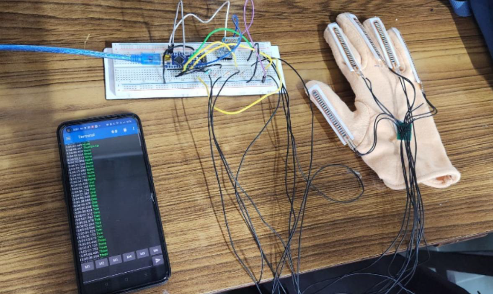

# Sign Language Detection Gloves
## Motivation

Sign language is a crucial mode of communication for the deaf and hard-of-hearing community. However, challenges arise when they need to communicate with someone unfamiliar with the language. Access to sign language interpreters and resources can be limited. Our goal is to make communication more seamless and independent by developing a portable, user-friendly sign-detection module. For more details, please refer to the report in this repository.

## Future Work

The circuit size can be further reduced to enhance portability. Alternatively, a camera module could be used for sign language detection via Computer Vision instead of flex sensors.
